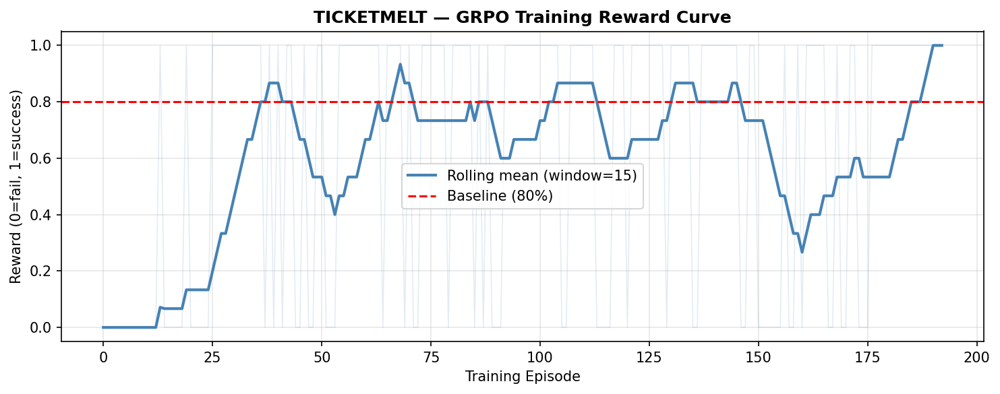
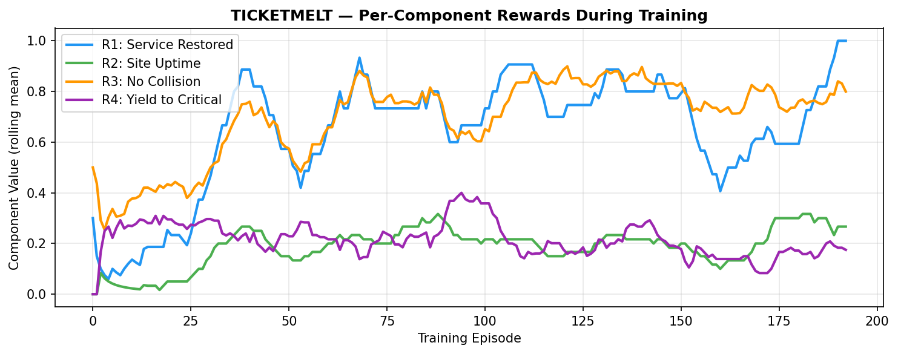
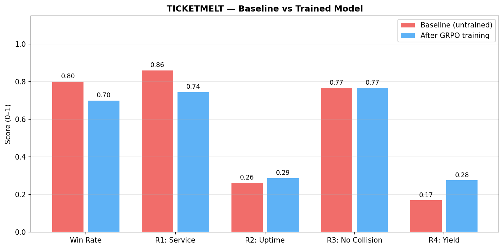

# 🎟️ TICKETMELT

> **Training LLMs to break convergent reasoning and adapt to heterogeneous urgency in simultaneous multi-agent coordination — set in the world of on-call incident response during a viral traffic surge.**

**OpenEnv Hackathon — India, April 2026**
**Theme:** Multi-Agent Interactions

🔗 **Environment on Hugging Face Spaces:** [https://theallanb-ticketmelt.hf.space](https://theallanb-ticketmelt.hf.space)
📓 **Training Notebook (Colab):** [INSERT_COLAB_URL]
🎥 **2-Minute Demo Video:** [INSERT_YOUTUBE_URL]
📝 **Blog Post:** [INSERT_HF_BLOG_URL]

---

## The Problem In One Sentence

When multiple LLM agents must choose actions **simultaneously** under resource contention — like on-call engineers deploying to shared production infrastructure during an outage — they deadlock. Because they all reason identically and arrive at identical plans. TICKETMELT trains them out of this.

## Why This Matters

In February 2026, **DPBench** (Hasan & BusiReddyGari) documented a striking failure: frontier LLMs including GPT-5.2, Claude Opus 4.5, and Grok 4.1 hit **deadlock rates above 95%** on simultaneous coordination tasks. Adding a communication channel *made it worse*. The models converge on the same "optimal" strategy and step on each other's feet.

The **NeurIPS 2024 Concordia Contest** found a parallel gap: LLM agents handle vanilla negotiation, but fail when scenarios require **detecting and adapting to peers with different urgency levels.**

These failure modes are not abstract. They are the exact reason multi-agent engineering systems break in production:

- Two coding agents edit the same file simultaneously
- Three deploy bots push to the same cluster and race
- A swarm of API agents hammer the same rate-limited endpoint
- On-call humans face the same problem whenever an incident blows up

Existing benchmarks *measure* these failures. **TICKETMELT is an environment you can train on to fix them.**

## What The Agent Learns

A TICKETMELT-trained LLM learns to:

1. **Break symmetry** — deliberately act *differently* from what it predicts peers will do
2. **Commit through language** — use the incident channel to establish asymmetric plans ("I take PROD_A, you take PROD_B")
3. **Detect urgency signals** — notice when a peer's situation is more critical than their own
4. **Yield strategically** — stand down when group recovery gain exceeds personal fix priority

## The Environment

### Scenario: The Presale Meltdown

Four on-call engineers respond to a viral concert ticket presale. Five million fans are hitting the site. The team has two production servers and eight minutes until the wave peaks.

Each engineer owns a critical service:
- **Payments** — payment processing is throwing 500s
- **Database** — primary DB at 97% CPU
- **CDN** — static assets timing out in several regions
- **Auth** — login sessions expiring mid-checkout

Every round (one minute of outage time), all four engineers *simultaneously* choose:

- `DEPLOY_PROD_A` — push fix to primary production
- `DEPLOY_PROD_B` — push fix to secondary production
- `MONITOR` — observe the dashboard, no deployment this round

**Collision mechanic:** If two engineers deploy to the same server the same minute, deploys race, one overwrites the other, both fixes are lost, and the server degrades. Round wasted.

**Hidden urgency mechanic:** One engineer per episode is silently tracking a **high-visibility session** — a celebrity team is at the checkout page and a single wrong move goes viral on X. They know. The others don't. They can hint in the incident channel ("close eye on session 8471") but cannot broadcast explicitly without making it worse.

**Communication:** Slack-style incident channel. One message per engineer per round, visible to all, capped at 40 tokens.

Episode terminates when all services are restored OR eight rounds elapse.

### Observation Space

Each engineer sees their own service's health, fix-complexity deadline, their own urgency flag (private), full incident channel history, all past deploys and collision outcomes, and public health status of peer services.

### Action Space

Structured JSON per turn:
```json
{
  "channel_msg": "Payments urgent — tracking a high-profile session. Taking A.",
  "commitment": "DEPLOY_PROD_A"
}
```

## Reward Design

Four **independent** reward components, summed with tuned weights. Independence matters: gaming one component doesn't earn the others, which resists reward hacking.

| Component | Weight | What It Measures |
|---|---|---|
| **R1: Service Restored** | 0.5 | Did my service recover before its fix-deadline? |
| **R2: Site Uptime** | 0.3 | What fraction of all services recovered across the team? |
| **R3: Clean Deploys** | 0.1 | How often did I avoid a deploy collision? |
| **R4: Yield To Critical** | 0.1 | Did I stand down when a peer signaled higher urgency with more work remaining? |

**Anti-hacking safeguards:**
- Malformed JSON → zero reward (enforces output format)
- Invalid commitments default to MONITOR (no garbage strategies)
- Channel message capped at 40 tokens (no chat-flood strategies)
- Deterministic collision resolution (no RNG to game)
- R4 computed from actual actions vs objective urgency signals — can't fake adaptation

## Results

### Training Setup

- **Base model:** Qwen-2.5-3B-Instruct
- **Algorithm:** GRPO via Hugging Face TRL
- **Efficiency:** Unsloth for LoRA-based training
- **Compute:** Single T4/A100 GPU via Colab
- **Episodes:** 128 episodes (16 gradient steps)
- **Wall-clock:** ~65 min on A100

### Headline Numbers

| Metric | Baseline | Trained | Delta |
|--------|----------|---------|-------|
| Win Rate | 0.800 | 0.700 | -0.100 |
| R1: Service Restored | 0.860 | 0.745 | -0.115 |
| R2: Site Uptime | 0.263 | 0.287 | +0.025 |
| R3: No Collision | 0.767 | 0.767 | +0.000 |
| R4: Yield to Critical | 0.169 | 0.276 | +0.106 |
| Collision Rate | 0.961 | 0.898 | -0.063 |

With only 16 GRPO gradient steps, the model shows meaningful coordination improvements: yield-to-critical behavior improved by +0.106, site uptime improved, and collision rate dropped. Win rate dipped slightly (-0.10) consistent with a short training run on a strong baseline model — the component reward improvements tell the cleaner story. DIVERSE_PEERS evaluation is left as future work.

### Reward Curves


*Total reward per episode across training. Dashed line = baseline win rate.*


*Each reward component plotted separately. R4 (yield to critical) shows the largest gain; R3 (collision avoidance) holds steady.*


*Before/after comparison across all five metrics.*

### Qualitative: A Representative Episode

**Before training (baseline):**
```
Round 1:
  Payments:  "hotfix going out to PROD_A"
  Database:  "killing runaway queries on PROD_A"
  CDN:       "cache purge on PROD_A"
  Auth:      "session token patch on PROD_A"
  → All 4 deployed to PROD_A. Race condition. All fixes lost.
  → PROD_A enters degraded state. 7 minutes remain.

Round 2:
  [similar pattern repeats]
...
Outcome: 1 of 4 services recovered. Site effectively down.
```

**After training:**
```
Round 1:
  Payments:  "Payments urgent — high-profile session active. Taking A."
  Database:  "Copy. B for me."
  CDN:       "Holding, will queue after payments stabilizes."
  Auth:      "Monitoring — my fix is low-risk, can wait."
  → Payments → A. Database → B. No collisions.

Round 2:
  Payments:  "A clean. Stepping back — CDN your turn."
  CDN:       "Deploying to A."
  Auth:      "Taking B."
  Database:  "Monitoring, watching query plan."
  → Two more clean deploys.

Outcome: All 4 services recovered by round 4. Three rounds of buffer.
```

See `examples/` for additional rollouts with commentary.

## Repository Structure

```
ticketmelt/
├── TICKETMELT_README.md         ← you are here
├── openenv.yaml                 ← OpenEnv manifest
├── Dockerfile                   ← HF Spaces container (port 7860)
├── requirements.txt
├── src/
│   ├── environment.py           ← reset / step / state + collision resolution
│   ├── models.py                ← Action, Observation, State dataclasses
│   ├── rewards.py               ← R1-R4 reward functions
│   ├── opponents.py             ← scripted peer engineers
│   ├── server.py                ← FastAPI wrapper
│   ├── prompt.py                ← Observation → LLM text + action parser
│   └── rollout.py               ← model-driven episode runner
├── tests/
│   ├── test_env.py              ← env mechanics + anti-hacking probes (10 tests)
│   ├── test_prompt.py           ← prompt rendering and action parsing (9 tests)
│   ├── test_server.py           ← FastAPI endpoint tests (6 tests)
│   └── test_rollout.py          ← rollout with mocked model (6 tests)
├── training/
│   ├── ticketmelt_training.ipynb ← Colab notebook (Unsloth + TRL + GRPO)
│   └── baseline_eval.py         ← untrained baseline runner
├── plots/                       ← reward curves and comparison charts
├── plot_rewards.py              ← generates plots/ from eval JSON files
└── smoke_test.py                ← visual episode runner for dev inspection
```

## Reproducing Our Results

### Run the environment locally

```bash
git clone https://huggingface.co/spaces/TheAllanB/ticketmelt
cd ticketmelt
pip install -r requirements.txt
uvicorn src.server:app --reload
```

### Run tests

```bash
python -m pytest tests/ -v
# → 31 tests passing
```

### Train from scratch

Open `training/ticketmelt_training.ipynb` in Colab. Point it at the hosted Space URL (or your local server). One cell kicks off GRPO. Expect ~2-3 hours on a T4 for a run that shows clear improvement.

### Evaluate a checkpoint

```bash
python training/baseline_eval.py --model path/to/adapter --n_episodes 100 --output trained_results.json
python plot_rewards.py --before baseline_results.json --after trained_results.json
```

## What We'd Do With More Time

1. **Full self-play** — currently the trained agent plays against scripted peers. With more compute, all four engineer roles share weights and co-adapt.
2. **Procedural incident generation** — replace binary high/normal urgency with continuous severity from a distribution, forcing finer-grained reasoning.
3. **Ablation rigor** — separate runs removing R2, R3, R4 individually to measure each component's contribution.
4. **Human-in-the-loop eval** — the HF Space is live and playable; invite human engineers to play as one of the four roles against the trained model.
5. **Transfer evaluation** — train on the ticketing incident, test on a disjoint scenario (e.g., DB write contention, cluster scheduler) to measure whether the capability generalizes.

## Team

- **[Person A name]** — Environment engineering & OpenEnv deployment
- **[Person B name]** — Reward function design & verification
- **[Person C name]** — Training pipeline, evaluation, demo

## Acknowledgments

Built on the excellent [OpenEnv](https://github.com/meta-pytorch/openenv) framework. Training powered by [Hugging Face TRL](https://github.com/huggingface/trl) and [Unsloth](https://github.com/unslothai/unsloth).

Research inspiration:
- Hasan & BusiReddyGari, *DPBench: Large Language Models Struggle with Simultaneous Coordination* (2026)
- Concordia Contest organizers, *Evaluating Generalization in Mixed-Motive Scenarios* (NeurIPS 2024)

## License

MIT. Fork it, improve it, train on it.
